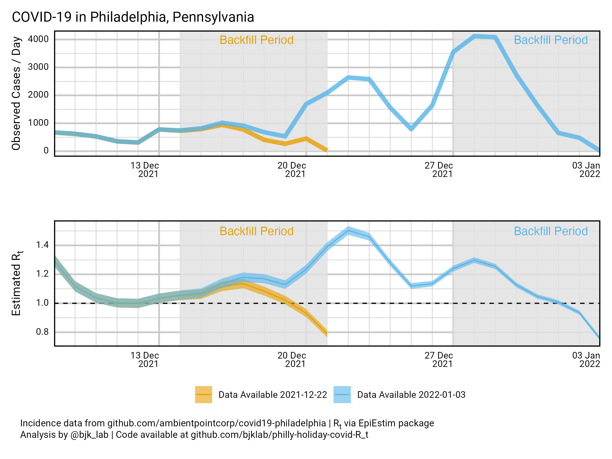

Watch Out for the Case Backfill!
================
Brendan J. Kelly, MD, MS

The <a href="https://policylab.chop.edu/">CHOP Policy Lab</a> has
provided valuable, epidemiology-based counsel to federal, state, and
local public policy partners throughout the COVID-19 pandemic, drawing
on the
<a href="https://policylab.chop.edu/covid-lab-mapping-covid-19-your-community">impressive
suite of data visualization tools and models they have developed to
predict COVID-19 case incidence and other outcomes</a> based on an
estimate of the instantaneous reproduction number (R), wherein “the
future R is estimated from an autoregressive linear mixed effects model
that includes county-level population density, 3-day average of social
distancing, and lagged non-linear averaged historical temperatures
effects over the prior 14 days.”

This week, the Philadelphia School District
<a href="https://twitter.com/SDPHite/status/1476929249407913986?s=20">based
a plan to return to in-person school</a> on the
<a href="https://twitter.com/PolicyLabCHOP/status/1478037201892122630?s=20">CHOP
Policy Lab’s</a> 22 December 2021 model estimate that Philadelphia
County COVID-19 R was declining, and that COVID-19 cases would soon
follow suit</a>. The School District’s decision has
<a href="https://www.inquirer.com/opinion/commentary/philly-schools-omicron-return-january-4-in-person-20220103.html">come
under scrutiny</a> as COVID-19 cases have continued to rise locally
(4119 observed cases on December 28, 2021, in contrast to model’s
prediction of a peak 680 cases/day).

I wanted to understand how <b>case backfill</b>, the process of updating
COVID-19 daily case counts for up to a week after the initial daily case
counts are recorded, might impact estimates of the COVID-19 reproductive
number (Rt) and predictions of future COVID-19 incidence
based on Rt. During the winter holiday season, short staffing
may result in data entry and transfer delays that increase the impact of
case backfill. To understand the holiday backfill effect, I compared the
COVID-19 case data available for Philadelphia, Pennsylvania on 22
December 2021 to the case data available today, 3 January 2022:

In the top panel, the comparison of incidence data demonstrates that
<b>case backfill</b> significantly increased cases in the week prior to
December 22, 2021. In the bottom panel, the effect of this missing data
to skew Rt below 1 can be seen. (Rt was estimated
using a mean serial interval of 2.2 days (SD 0.8 days), based on the
best available data on the
<a href="https://www.medrxiv.org/content/10.1101/2021.12.25.21268301v1">Omicron
variant</a>, using the <a href="">EpiEstim R package</a>. The 95%
confidence interval for Rt is shown).

A naive model for Rt based on the most recent available data
again suggests that Rt is trending down… but this should not
be cause for excess optimism in light of the <b>holiday backfill
effect</b> seen last week!
